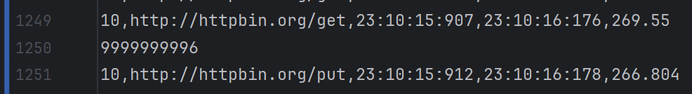

Start the project with the following command:
```bash
pip install -r requirements.txt
```
Execute monitoring.py with the following command:
```bash
python ./dupa/monitoring.py ./dupa/results.csv --use_interval
```

Problems
- look at the data in the results.csv file. There was problem that miliseconds were not being written in the row with the rest of data, but the row below. After that monitoring.py has got a problem to read it.
- 


################################################################
I've got:
-computer with Windows 11
-fresh installed system
-Pycharm
-python 3.13
-git installed
-project name: RoadRunner

<General informations>
I want to create an application that can execute a performance test case using scenarios divided by steps.
Each python class has to be in a different file.
Steps have to be executed one after another.
Each step has to send a request to the chosen url using the chosen method, headers and body.
All the project files have to be in the same folder.
User is a thread.
</General informations>

<Test scenario>
Example of test scenario:
step1 = Scenario("First URL").set_url("http://httpbin.org/get").set_method("GET").set_headers("").save(
    "X-Amzn-Trace-Id")
step2 = Scenario("Second URL").set_url("http://httpbin.org/post").set_method("POST").set_headers("").set_body(
    "X-Amzn-Trace-Id: {X-Amzn-Trace-Id}")
step3 = Scenario("Third URL").set_url("http://httpbin.org/put").set_method("PUT").set_headers("")
</Test scenario>

<Execute tests format>
Run.speed(users number, time in seconds)
When you see code like this:
Run.speed(1, 10)
Run.speed(2, 10)
Interpret it as follows:
For the first 10 seconds, one thread should send requests to the server.
After that, for another 10 seconds, two separate threads should simultaneously send requests to the server.
Each thread operates independently, and the number before the comma indicates the number of threads, while the number after the comma represents the duration in seconds.
</Execute tests format>

<Save results>
All the http requests and responses have to be printed in the console.

Response time for each request has to be saved to the same path as all files and be named results.csv. 
If the results.csv file doesn’t exist in the project folder, it has to be created just after the test scenario stopped working. 

File has to be created using format: VusersNumber,URL,StartTime,EndTime,ResponseTime[ms].
First line of the results.csv file has to be: VusersNumber,URL,StartTime,EndTime,ResponseTime[ms].
The response time of each request has to be saved line by line in this file.
VusersNumber should present the number of threads that are currently sending the requests and waiting for response. This number has to be strongly connected to first value of Run.spped(x,y).
For the fields: StartTime,EndTime,ResponseTime time must be recorded to the millisecond precision.
For the fields: StartTime,EndTime, the time have to be saved in format yyyy-MM-dd-HH:mm:ss:ms
</Save results>
